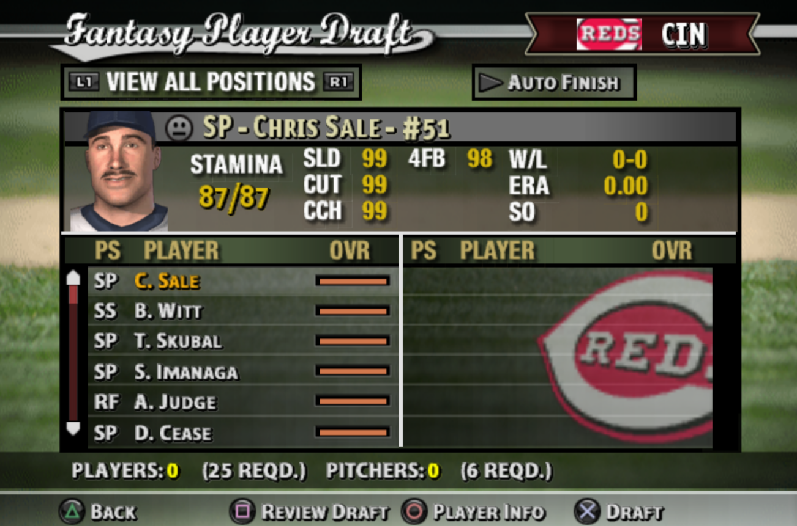
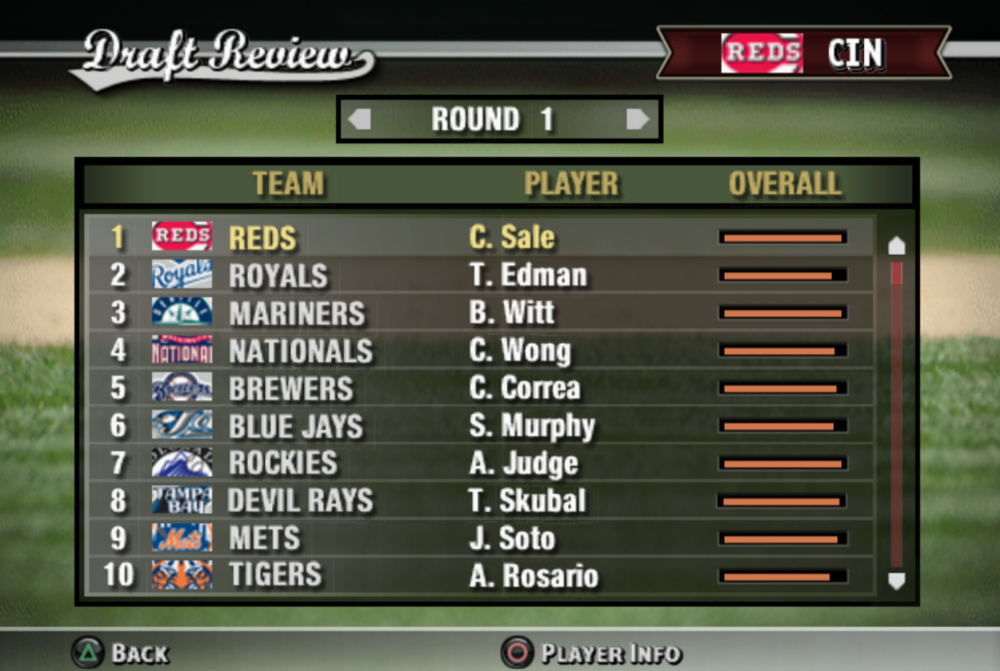
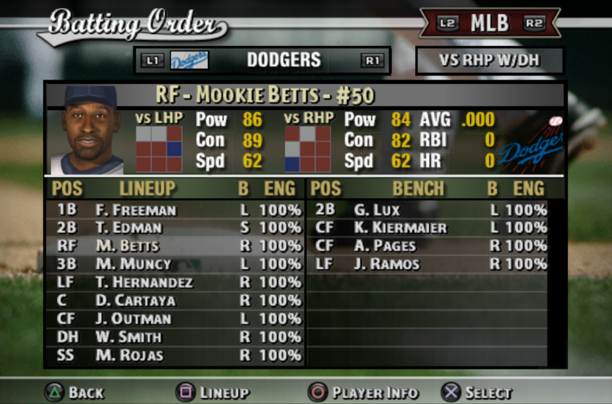
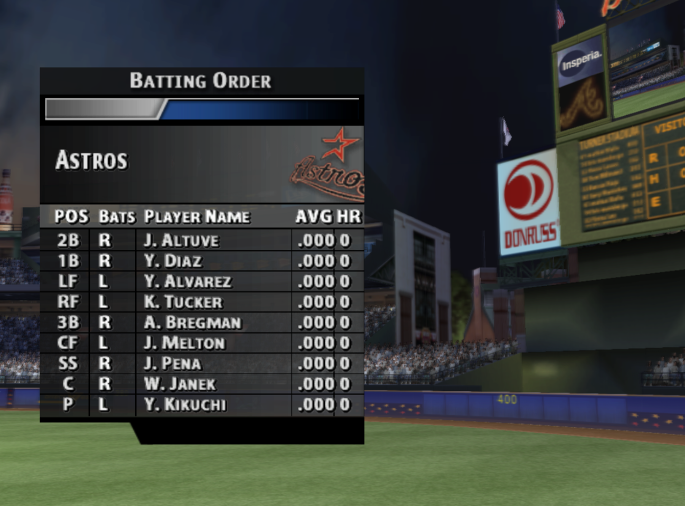
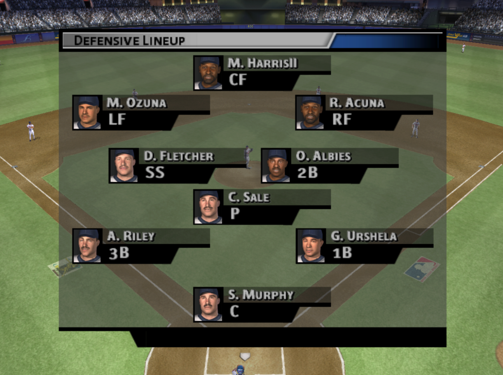

# MVP Baseball 2024 (PS2)

<!-- badges: start -->
<!-- badges: end -->

This GitHub repo provides memory cards that have updated rosters
for MVP Baseball 2005 on PS2.

This will only work for the PS2 version of MVP Baseball 2005, not for other
platforms or games.

## Instructions (advanced)

Download the latest memory card from [Releases page](https://github.com/CollinErickson/MVP2005/releases/).
The memory card is a ".ps2" file that contains a roster file that you should load.

## Instructions (beginner)

### Using PCSX2 emulator for Windows/Linux:

1. Download and install PCSX2.

2. Legally acquire the PS2 BIOS and a copy of MVP Baseball 2005 for PS2.
Put these both in the proper folders. If you need help, Google it or post
in the PCSX2 forums.

3. Download the latest memory card file from the [Releases page](https://github.com/CollinErickson/MVP2005/releases/).
Look at the most recent release, and download the ".ps2" file, which is the 
memory card.
Put this file in the memory card folder for PCSX2. In PCSX2, open the memory
card settings, and put the memory card in one of the two slots.

4. Start the game in PCSX2. Navigate to the Rosters option and then Load Rosters.

### Using PS2

I haven't tried this. If you get this to work, let me know what steps you
did and I'll put it here.

## FAQs

### I'm confused. What am I supposed to do?

See the Instructions (Beginner) above. You don't need all the files in this
repo, you only download a single memory card file from the 
[Releases page](https://github.com/CollinErickson/MVP2005/releases/).

### How can I contribute?

If you see any issues, report it on the
[Issues tab](https://github.com/CollinErickson/MVP2005/issues)
above.

If you are enjoying it, let me know by starring this repo or sending me an 
email at collinberickson (at) gmail (dot) com.
Also please share with your friends!

Some help could be used to make better attributes, but it's not straightforward.
If you want to help, you can email me.

### Will there be future updates?

I can easily rerun the code to remake the updated rosters, but I will likely
only do so if there is demand since it takes about 50 hours of computer time.
Email me or watch this repo so that I know
you are interested.

### How can I be notified about future updates?

On this page, click on "Watch", then "Custom", then check "Releases" and 
click apply. You should receive an email when there is a new release.
(I have never actually tried this, correct me if I'm wrong.)

### Why are the players from 2005 on the minor league teams with horrible stats?

The old players can't be deleted. The best option is to make them horrible
so that they fill up the AA/A. Only 25 players can be created, and there are a
limited number of players that can be edited, so I could only create about 66
players per org, which requires some of the old players to fill out the rosters.
I wanted to do 100 players per org, but it's not possible without somehow
modding the game file.

## Known issues

* Pitchers are too good relative to position players. Next time I'll make
batters contact/power a little higher, and make pitch movement/control lower.

* Heatmaps for both vs LHP and vs RHP were done using contact and power vs LHP.
I fixed the code, this will be fixed in the next version.

* Player heights and weights don't match reality. This is because you cannot
edit these for any players, only the 25 players that can be created. I could
change the creation order to try to match heights/weights, but that is more
work than it's worth.

* My data source doesn't have 2-seamers, only sinkers, so I randomly converted
half of them to be 2-seam FB (need a better data source)

* Many pitchers are missing pitches

* No rare pitches (a few pitchers should have knuckleball, screwball, forkball)

* Better calibration of the attributes. E.g., maybe there are too many/few
hitters with contact v LHP over 90. (Need help identifying these.)

* Better attribute values (a lot seem weird). Some players are too good/bad.

* Players at the wrong level (MLB on AAA, etc). The game optimized the roster
for each team, I'm not going to manually fix any of these.

## Screenshots

### Top players in the dynasty fantasy draft

The top players look pretty reasonable.

### First players in a dynasty fantasy draft

Edman is a bit of a reach with the second pick, passing on Witt is sure
to anger Royals fans.

### Dodgers batting order

Ohtani is a pitcher, and two way players don't really work in this game.
If you prefer him as a batter than as a pitcher, go to edit players and change
his position.

### Astros lineup in game

### Braves defense in game

Gio Urshela gets the start over Matt Olson due to having better stats,
which is due to my data source. Hopefully we can get better attributes in the
future.

